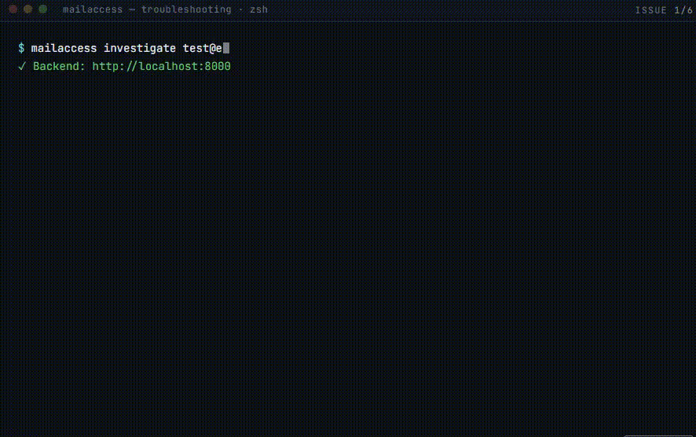

<pre align="center">
███╗   ███╗ █████╗ ██╗██╗      █████╗  ██████╗ ██████╗███████╗███████╗███████╗
████╗ ████║██╔══██╗██║██║     ██╔══██╗██╔════╝██╔════╝██╔════╝██╔════╝██╔════╝
██╔████╔██║███████║██║██║     ███████║██║     ██║     █████╗  ███████╗███████╗
██║╚██╔╝██║██╔══██║██║██║     ██╔══██║██║     ██║     ██╔══╝  ╚════██║╚════██║
██║ ╚═╝ ██║██║  ██║██║███████╗██║  ██║╚██████╗╚██████╗███████╗███████║███████║
╚═╝     ╚═╝╚═╝  ╚═╝╚═╝╚══════╝╚═╝  ╚═╝ ╚═════╝ ╚═════╝╚══════╝╚══════╝╚══════╝
</pre>

[](LICENSE)
[](https://www.python.org/)
[](docker-compose.yml)
[](https://pypi.org/project/mailaccess/)
[](https://pypi.org/project/mailaccess/)

Self-hostable OSINT platform for investigating email addresses. Fan out across breach databases, social networks, DNS records, and the open web — get back a unified exposure score and structured findings you can export or pipe into Maltego.

Built for security researchers, OSINT analysts, and penetration testers operating under authorization. Read [DISCLAIMER.md](DISCLAIMER.md) before use.

## Install

### CLI only (no Docker)

```bash
pip install mailaccess

# Option A: auto-start (simplest)
mailaccess investigate you@example.com
# Server starts automatically, runs investigation,
# stops when done.

# Option B: keep server running
mailaccess serve  # in one terminal
mailaccess investigate you@example.com  # in another

# Option C: full stack with Web UI
git clone https://github.com/YOUR_USERNAME/mailaccess
docker compose up -d
```

## Quick Start

```bash
mailaccess investigate you@example.com
mailaccess investigate you@example.com -o report.pdf
mailaccess investigate you@example.com --format jsonl
mailaccess investigate -                        # read email from stdin
mailaccess serve                                # start backend server on :8000
mailaccess keys list
mailaccess keys set HIBP_API_KEY your-key-here
mailaccess modules
mailaccess doctor                               # coming soon

# Enable specific opt-in modules for one run
mailaccess investigate email -m breach_deep
mailaccess investigate email -m all
```


## What It Does

- **Identity graph** — cross-platform correlation of accounts, usernames, and signals from each investigation
- **Phone number recovery** — pipeline to surface and validate numbers tied to the target
- **Telegram / WhatsApp hints** — lightweight messaging-app footprint checks alongside other modules
- **YAML-driven platform system** — social-style checks defined in `backend/platforms/`; community extensible without new Python for each site
- **Deep breach mode** — checks top 100 highest-severity breached sites for account existence
- **Historical intelligence** — Wayback Machine archive search + GitHub commit author search
- **Recursive email discovery** — recovers other emails owned by the same person via name correlation
- **Credential Risk Score** — separate 0-100 credential risk signal with LOW / MODERATE / HIGH / CRITICAL banding, top drivers, and recommended next steps
- Concurrent module execution — all modules run in parallel, results stream as they arrive
- WebSocket streaming — partial results arrive in real time without polling
- REST API + web UI + CLI — use whatever interface fits your workflow
- Plugin module system — drop a `.py` file in `backend/modules/` and it auto-registers; no wiring required
- 6 export formats: JSON, CSV, PDF, Markdown, STIX 2.1, Maltego XML
- Maltego local transform server — run investigations directly from the Maltego desktop app
- Webhook notifications — Slack, Discord, or any HTTP endpoint
- Exposure score (0–100) with risk label: low / medium / high / critical
- SQLite by default; PostgreSQL optional via Docker Compose profile

## Modules

| Module | Coverage | Key Required | Opt-in |
|--------|----------|--------------|--------|
| gravatar | Profile hash lookup | No | No |
| hibp | Breach check | Yes | No |
| breach_deep | Probes top 100 highest-severity breached sites for account existence | No (HIBP corpus fetched automatically) | Yes |
| emailrep | Reputation + blacklist | No | No |
| hudson_rock | Infostealer logs (free) | No | No |
| google_dork | 5 automated dorks | Yes (SerpAPI) | No |
| email_discovery | Recovers other email addresses owned by same person via name dorks | Yes (SERPAPI_KEY) | No |
| domain_intel | Domain + Shodan | No (Shodan optional) | No |
| dns_lookup | MX/SPF/DMARC/DKIM/A/NS extraction | No | No |
| whois_lookup | Domain WHOIS, privacy detection | No | No |
| wayback | Finds historical pages where email appeared publicly via Wayback Machine CDX | No | No |
| github_commits | Finds repos committed to with this email, surfaces real name from git config. Requires GITHUB_TOKEN for commit search; user profile search works without token. | No (GITHUB_TOKEN optional, required for commit search) | No |
| xposedornot | Default-on direct email-to-breach corpus lookup with breach names, data classes, and risk indicators | No | No |
| leakcheck | Default-on public breach corpus lookup with regional coverage and stealer routing | No | No |
| ransomware_intel | Default-on domain victim correlation against ransomware lists; skips free providers | No | No |
| social | 13 platforms via YAML | No | No |
| social_links | Username extraction, feeds pivot | No | No |
| account_discovery | Holehe 120+ platforms | No | Yes |
| user_scanner | 205+ platform vectors | No | Yes |
| whatsmyname | 700+ platforms | No | Yes |
| breachdirectory | 2nd breach source | Yes | No |
| username_pivot | WMN via recovered usernames | No | Yes |
| permutation_discovery | 60 email variants | No | Yes |
| phone_intel | Phone validation + WA/TG hints | No | No |
| messaging_hints | Telegram/WhatsApp username check | No | No |
| ghunt | Gmail deep intel | No (setup required) | Yes |
| identity_graph | Cross-platform cluster analysis | No | No (automatic) |

> 28 modules, 800+ platforms checked when all opt-in modules enabled. YAML platform system — add new platforms via PR, no Python required.

## Identity Graph

Every investigation generates a cross-platform identity graph linking accounts by shared usernames, photos, display names, and breach data. View at:

`/investigation/:id/graph`

Export as D3-compatible JSON via `GET /api/report/{id}/graph` or fetch clusters with confidence scores via `GET /api/report/{id}/clusters`.

Findings are automatically grouped into identity clusters with confidence scoring. Use `--show-collisions` to expand low-confidence matches in CLI output.

## Historical Intelligence

MailAccess searches the Wayback Machine CDX API for archived pages where the email appeared publicly — catching deleted blog posts, old forum signatures, and removed contact pages.

GitHub commit history is searched by author email, revealing repos contributed to, real name from git config, and development activity timeline.

## Deep Breach Mode

Enable with `ENABLE_BREACH_DEEP=true`.

Fetches the full HIBP breach corpus on startup, ranks sites by severity (record count × data class multipliers), then probes the top 100 highest-severity sites for account existence via YAML probes and generic reset-flow inference. Findings show breach name, record count, data classes, and severity — giving analysts a probabilistic credential exposure estimate.

Example output:

```text
⚠ adobe.com    CRITICAL  153M records
  [Passwords, Email, Password hints]
✓ dropbox.com  HIGH       69M records
  [Email, Passwords]
~222M records across 2 breaches potentially include this email's credentials
```

## Pipeline

MailAccess is pipeline-friendly: read target emails from stdin, stream JSONL output, and branch on exit codes in CI/CD scripts.

```bash
# Batch from file
cat emails.txt | mailaccess investigate -

# Stream JSONL
mailaccess investigate you@example.com --format jsonl | jq .

# Filter critical findings
mailaccess investigate you@example.com --format jsonl | jq 'select(.severity=="critical")'
```

**Exit codes:** `0` clean · `1` findings · `2` breaches · `3` error

See [docs/integrations.md](docs/integrations.md#pipeline-integration) for GitHub Actions examples.

---

## Adding a Platform

No Python required. Drop a YAML file in `backend/platforms/`:

```bash
cp backend/platforms/TEMPLATE.yaml backend/platforms/mysite.yaml
```

Edit fields, submit PR.

See [CONTRIBUTING.md](CONTRIBUTING.md) for full guide.

## Export Formats

| Format | `?format=` value | Use case |
|--------|-----------------|----------|
| JSON | `json` | Programmatic use, archiving |
| CSV | `csv` | Spreadsheet analysis |
| PDF | `pdf` | Human-readable reports |
| Markdown | `markdown` | Wikis, issue trackers |
| STIX 2.1 | `stix` | Threat intelligence platforms |
| Maltego XML | `maltego` | Maltego graph import |

## Integrations

| Integration | How |
|-------------|-----|
| Maltego | Local transform server at `POST /maltego/email_investigate` (no API key required) |
| Slack | Set `SLACK_WEBHOOK_URL` in `.env` |
| Discord | Set `DISCORD_WEBHOOK_URL` in `.env` |
| Generic webhook | `INTEGRATION_WEBHOOK_URL` + optional `INTEGRATION_WEBHOOK_SECRET` (HMAC) |

## Self-Hosting

```bash
cp .env.example .env      # all API keys are optional
docker compose up         # backend :8000  ·  frontend :3000
```

Open **http://localhost:3000** in your browser. Full setup guide: [docs/self-hosting.md](docs/self-hosting.md).

## CLI Reference

| Command | Description |
|---------|-------------|
| `mailaccess investigate <email>` | Run a full investigation against an email address |
| `mailaccess investigate -` | Read target email from stdin |
| `mailaccess serve` | Start the backend server on :8000 |
| `mailaccess history` | List past investigations |
| `mailaccess keys list` | Show all configured API keys |
| `mailaccess keys set <KEY> <value>` | Set an API key |
| `mailaccess keys unset <KEY>` | Remove an API key |
| `mailaccess config set-url <url>` | Point the CLI at a MailAccess instance |
| `mailaccess modules` | List all available modules |
| `mailaccess commands` | List all CLI commands |
| `mailaccess doctor` | Check configuration and module health _(coming soon)_ |
| `mailaccess investigate <email> -m` / `--enable` | Enable opt-in modules for this run only. Comma-separated or `all`. Example: `-m breach_deep,ghunt` |

The `--output` / `-o` flag on `investigate` saves the report to a file. The extension determines the format: `.json`, `.csv`, `.pdf`, `.md`, `.stix.json`, `.maltego.csv`.

## API Keys

| Key | Module | Where to get it | Required? |
|-----|--------|-----------------|-----------|
| `HIBP_API_KEY` | `hibp` | https://haveibeenpwned.com/API/Key | Yes (module skips without it) |
| `SERPAPI_KEY` | `google_dork` | https://serpapi.com | Yes (module skips without it) |
| `SHODAN_API_KEY` | `domain_intel` | https://account.shodan.io | No |
| `EMAILREP_API_KEY` | `emailrep` | https://emailrep.io | No |
| `HUNTER_IO_API_KEY` | `hunter_io` | https://hunter.io | No |
| `GITHUB_TOKEN` | `github_commits` | https://github.com/settings/tokens | No (optional) |
| `SLACK_WEBHOOK_URL` | Webhooks | https://api.slack.com/messaging/webhooks | No |
| `DISCORD_WEBHOOK_URL` | Webhooks | Discord server settings | No |

## Changelog

### 0.5.3
- Cluster identity analysis no longer shows raw traceback
  on timeout — shows dim fallback message instead
- Hardcoded minimum timeout floors for pip-installed users:
  account_discovery 120s, username_pivot 60s,
  user_scanner 180s, whatsmyname 200s
- .env overrides still win if set higher

### 0.5.2
- Config resilience: CORS_ORIGINS and dict fields now
  accept plain strings, comma-separated values, and
  empty strings without crashing
- No more SettingsError on first run with default .env
- Startup confirmation line shows config parsed correctly

### 0.5.1

- LeakCheck integration: free corpus lookup, covers CIS/regional breaches XposedOrNot misses
- XposedOrNot paste signals surfaced separately from breach signals in CLI and summary bar
- Ransomware domain victim correlation: checks email domain against ransomware victim lists (ransomware.live + ransomlook.io)
- Summary bar now shows three-part breakdown: Breaches: X | Pastes: Y | Stealer: Z
- LeakCheck stealer category correctly routed to stealer signal count not breach count
- Removed legacy credential_risk: null from JSON export

### 0.5.0

- XposedOrNot integration: free direct breach corpus lookup, no API key, default-on, closes ~70-80% of HIBP coverage gap
- Breach normalizer: deduplicates breach findings across all sources into single canonical records with source attribution
- Credential Risk Score: separate 0-100 score with band, top 3 score drivers, and recommended analyst actions. Infostealer hit forces CRITICAL. Surfaces in CLI, UI, all exports, and webhooks.

### 0.4.3

- `github_commits`: returns `PARTIAL` (not `FAILED`) without `GITHUB_TOKEN`, includes setup hint
- `whois_lookup`: IANA-managed domains now parse correctly, timezone-aware datetime fix, richer field extraction (`organisation`, `nserver`, `registered`, `expires`)

### 0.4.2

- Default modules now run without any flags: `whatsmyname`, `account_discovery`, `user_scanner`, `username_pivot`, `permutation_discovery`, `phone_intel`, `messaging_hints`
- `-m` / `--enable` flag for opt-in modules per run (`breach_deep`, `ghunt`, `email_discovery`)
- `-m all` enables all three opt-in modules
- Invalid `-m` module name shows helpful warning

### 0.4.1

- Deep breach mode and email discovery improvements
- Phone extractor false positive fixes carried forward

### 0.4.0

- Deep breach mode: probes top 100 highest-severity breached sites for account existence (opt-in, `ENABLE_BREACH_DEEP=true`)
- Name → email discovery: recovers other email addresses owned by same person via SerpAPI dorks (requires `SERPAPI_KEY`)
- Wayback Machine: CDX search for historical pages where email appeared publicly
- GitHub commit search: author-email search across all public commits, surfaces repos + real name from git config (`GITHUB_TOKEN` optional)
- Breach corpus: auto-fetched from HIBP public API, severity-ranked by record count × data class multipliers, cached 24h

## Troubleshooting



## Links

| | |
|-|-|
| [Self-hosting guide](docs/self-hosting.md) | Docker Compose, `.env` reference, PostgreSQL, proxy/Tor, Maltego setup |
| [Module reference](docs/modules.md) | All modules, findings schema, adding new modules |
| [API reference](docs/api.md) | REST endpoints, WebSocket events, authentication |
| [Export formats](docs/exports.md) | Supported formats, MIME types, filename conventions |
| [Integrations](docs/integrations.md) | Maltego, Slack, Discord, generic webhooks |
| [Contributing](CONTRIBUTING.md) | Adding modules, adding exporters, code style, PR checklist |
| [PyPI](https://pypi.org/project/mailaccess/) | `pip install mailaccess` |
| [GitHub](https://github.com/YOUR_USERNAME/mailaccess) | Source code, issues, releases |

## License

MIT. All data queried by MailAccess comes from public sources. See [DISCLAIMER.md](DISCLAIMER.md) for authorized use cases and legal responsibility.
